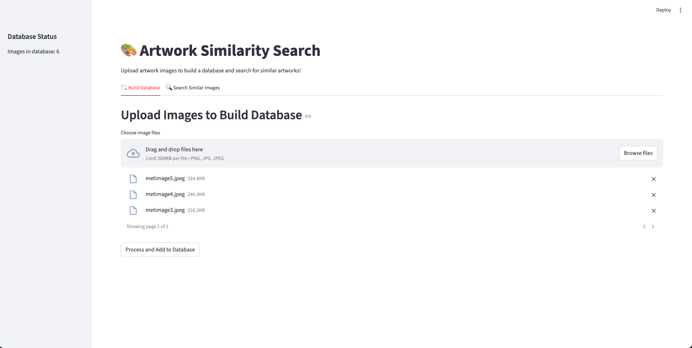
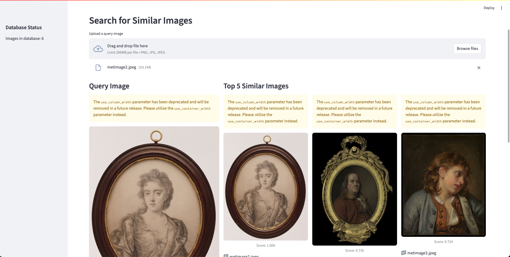

# Style Similarity Model for Artwork Retrieval

This project implements a style similarity search system for artworks using CLIP (Contrastive Language-Image Pre-Training) from Hugging Face. The system can identify visually similar artworks through an interactive Streamlit web application.

## Features

- **CLIP-based Embeddings**: Uses OpenAI's CLIP model via Hugging Face for high-quality image embeddings
- **FAISS Vector Database**: Efficient similarity search using Facebook's FAISS library
- **Interactive Web Interface**: User-friendly Streamlit application for uploading and searching artworks
- **Top-K Similar Images**: Returns the most similar artworks with confidence scores
- **Visual Results**: Display query and results with similarity scores
- **Persistent Storage**: Database saved between sessions for continuous use

## Project Structure

```
Style-Similarity-Model-for-Artwork-Retrieval/
├── streamlit_app.py                 # Streamlit web application
├── requirements.txt                 # Dependencies
├── README.md                        # This file
├── scaling_writeup.md              # Production scaling strategy
├── uploaded_images/                # Streamlit uploaded images (auto-created)
├── image_database.pkl              # FAISS metadata (auto-created)
└── image_index.faiss              # FAISS index (auto-created)
```

## Installation

1. Clone the repository:
```bash
git clone <repository-url>
cd Style-Similarity-Model-for-Artwork-Retrieval
```

2. Install dependencies:
```bash
pip install -r requirements.txt
```

## Usage

### Streamlit Web App

Run the interactive web application:

1. Launch the Streamlit app:
```bash
streamlit run streamlit_app.py
```

2. Open your browser to the provided URL (usually `http://localhost:8501`)

3. Use the web interface:
   - **🏗️ Build Database Tab**: Upload multiple images to build your artwork database
   - **🔍 Search Tab**: Upload a query image to find similar artworks

## How the App Looks

### Build Database Interface
The app provides an intuitive interface for uploading multiple artwork images to build your database. You can drag and drop files or browse to select them, with support for PNG, JPG, and JPEG formats. The interface shows upload progress and automatically processes images to generate CLIP embeddings.



### Search Interface and Results
Once you have images in your database, you can upload a query image to find similar artworks. The app displays your query image alongside the top similar matches with confidence scores. The results show how effectively CLIP embeddings capture visual similarity between artworks.



## How It Works

### Architecture

1. **Image Preprocessing**: Images are loaded and converted to RGB format
2. **Feature Extraction**: CLIP model generates 512-dimensional embeddings
3. **Normalization**: Embeddings are L2-normalized for cosine similarity
4. **Indexing**: FAISS creates an efficient search index
5. **Similarity Search**: Cosine similarity finds the most similar images
6. **Results**: Top-K results returned with confidence scores

### CLIP Model

- **Model**: `openai/clip-vit-base-patch16`
- **Architecture**: Vision Transformer (ViT) base model
- **Embedding Size**: 512 dimensions
- **Similarity Metric**: Cosine similarity (via inner product on normalized vectors)

### FAISS Integration

- **Index Type**: `IndexFlatIP` (Inner Product for cosine similarity)
- **Search**: Exact nearest neighbor search
- **Storage**: Persistent storage with pickle for metadata

## Dependencies

- `torch`: PyTorch for deep learning
- `transformers`: Hugging Face transformers for CLIP
- `Pillow`: Image processing
- `numpy`: Numerical operations
- `faiss-cpu`: Vector similarity search
- `streamlit`: Web application framework
- `tqdm`: Progress bars

## Performance Notes

- **GPU Support**: Automatically uses CUDA if available
- **Model Caching**: Streamlit caches the CLIP model for faster subsequent loads
- **Memory Usage**: Scales with number of images in database
- **Search Speed**: Sub-second similarity search for thousands of images

## Scaling Considerations

For production deployment, see the detailed [scaling write-up](scaling_writeup.md) which covers:

- **Distributed Storage**: Use cloud storage for images and embeddings
- **Database Scaling**: Consider Milvus or Pinecone for larger datasets
- **Batch Processing**: Process images in batches for memory efficiency
- **API Integration**: Convert to REST API for service integration
- **Monitoring**: Add logging and performance monitoring

## Troubleshooting

**Common Issues:**

1. **CUDA Out of Memory**: Reduce batch size or use CPU
2. **Missing Images**: Ensure images are in correct directory
3. **Model Download**: First run requires internet for model download
4. **File Permissions**: Ensure write permissions for database files

**Supported Image Formats:**
- JPEG (.jpg, .jpeg)
- PNG (.png)

## License

This project is licensed under the MIT License - see the LICENSE file for details.